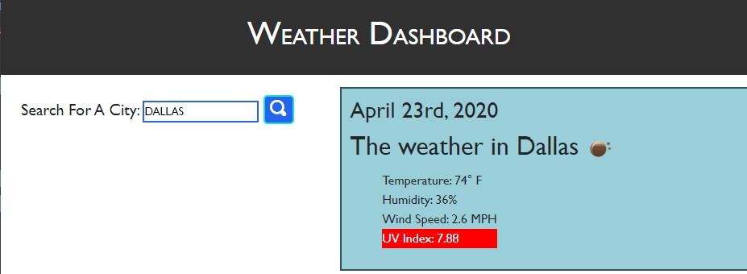

# Weather-App

## About
* User can search for a city and then be presented with the current and future conditions for that city.
* The result will also return the date and an icon that represents the current condition, temperature, humidity, wind speed, and UV index. 
* When user views the UV index, a color is shown that indicates whether the conditions are favorable, moderate or severe.
* Resutls provides a 5-day weather forcast
* A search history will also be available

## Built With
* HTML
* CSS
* JavaScript
* JQuery
* Bootstrap
* Moment.js
* Server Side API's
    * OpenWeatherMap

## Website
https://deannapi.github.io/weather-app/

## Made By DeAnna Martinez
